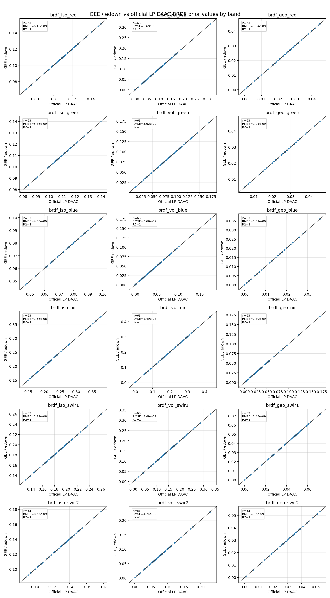
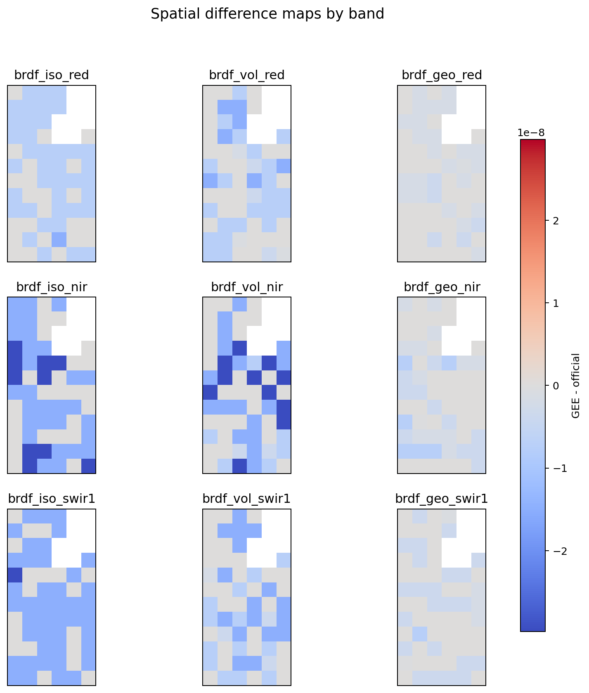
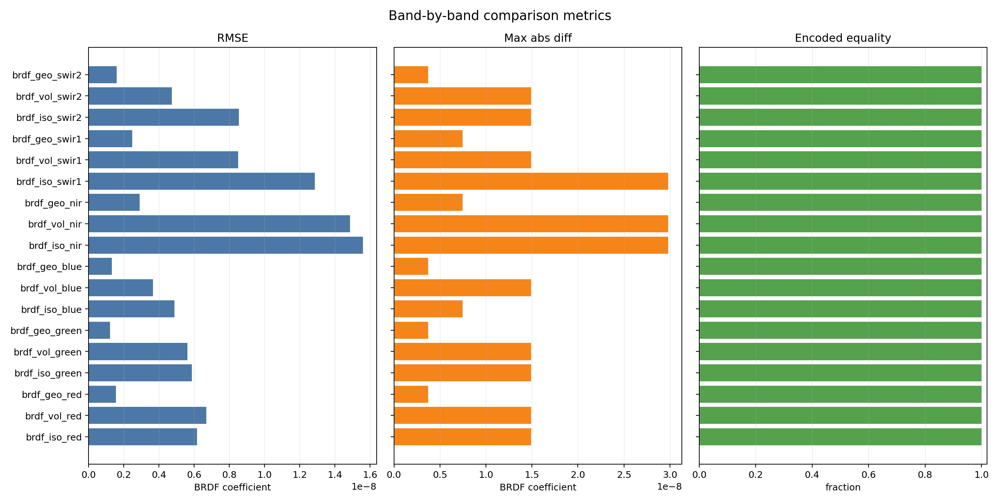

# Experiments

## GEE vs Official MCD43A1

This experiment compares two ways of building the same BRDF prior:

- Google Earth Engine `MODIS/061/MCD43A1`, downloaded as native-grid GeoTIFFs through `edown`.
- Official LP DAAC `MCD43A1.061` HDF granules, downloaded through Earthdata with `earthaccess`.

Both paths use the same AOI, date window, band set, best-pixel compositor, output encoder, and STAC/GeoTIFF persistence. The default band set covers MODIS red, green, blue, NIR, SWIR1, and SWIR2, with `iso`, `vol`, and `geo` BRDF kernel coefficients for each spectral band. The experiment writes two prior products and a comparison summary.

### Install

```bash
pip install "brdf-monthly-priors[experiments]"
```

The `experiments` extra installs `edown`, `earthaccess`, and `pyhdf`. The
official LP DAAC files are HDF4, so the script reads them with `pyhdf` instead
of depending on local GDAL HDF4 support.

Authenticate both services:

```bash
# Earth Engine service-account authentication used by edown
export GEE_SERVICE_ACCOUNT="service-account@project.iam.gserviceaccount.com"
export GEE_SERVICE_ACCOUNT_KEY="/path/to/key.json"

# Earthdata authentication used by earthaccess
export EARTHDATA_USERNAME="..."
export EARTHDATA_PASSWORD="..."
```

Existing local Earth Engine credentials and `.netrc` Earthdata credentials also work.

### Run

The default AOI is a small London window and the default date window is July 2024:

```bash
python examples/gee_vs_official_mcd43a1.py \
  --west -0.15 --south 51.48 --east -0.13 --north 51.50 \
  --start-date 2024-07-01 \
  --end-date 2024-07-31 \
  --output-root runs/gee-vs-official-mcd43a1
```

For a quick smoke run, limit the official granules:

```bash
python examples/gee_vs_official_mcd43a1.py \
  --start-date 2024-07-01 \
  --end-date 2024-07-01 \
  --max-official-granules 1
```

`earthaccess` temporal searches for MCD43A1 can return overlapping 16-day
windows whose native granule date falls outside the requested date range. The
script post-filters official granules by the `AYYYYDOY` value in the native
granule ID before downloading, so the official path is compared with the same
dated GEE images.

### Outputs

The experiment writes:

```text
runs/gee-vs-official-mcd43a1/
  comparison-summary.json
  figures/
    scatter-by-band.png
    difference-by-band.png
    metrics-by-band.png
  gee-edown-downloads/
  official-earthdata-downloads/
  gee-prior/<request-hash>/
    stac-item.json
    assets/prior/<index>-<band>.tif
    assets/uncertainty/<index>-<band>.tif
  official-prior/<request-hash>/
    stac-item.json
    assets/prior/<index>-<band>.tif
    assets/uncertainty/<index>-<band>.tif
```

The comparison summary reports:

- Native processing grid used for both products.
- Count of official granules downloaded and count of official observations that overlapped the GEE grid.
- Whether encoded prior arrays are byte-for-byte equal after one-band GeoTIFF encoding.
- Whether encoded uncertainty arrays are byte-for-byte equal after one-band GeoTIFF encoding.
- Per-band valid pixel count, maximum absolute float difference, mean absolute float difference, and encoded equal pixel count.
- Per-band scatter statistics: RMSE, signed bias, median absolute difference, 95th percentile absolute difference, Pearson `r`, `R2`, and linear fit slope/intercept.

### Figures

The script writes figures under `figures/` by default. Use `--skip-figures`
when running in a non-plotting environment, or `--figure-format pdf` / `svg`
when vector output is preferred.

#### Band-by-band scatter

Each subplot compares official LP DAAC values on the x-axis with GEE/`edown`
values on the y-axis for one BRDF kernel band. The black line is the one-to-one
line; points on that line indicate matching source values before encoded
GeoTIFF persistence.



#### Spatial differences

The difference map shows `GEE - official` for each band on the native
Sinusoidal grid. For this AOI the differences are only floating-point noise.



#### Metric bars

The metric plot summarizes RMSE, maximum absolute difference, and encoded
equality fraction by band.



### Observed smoke result

The all-band smoke command above was run against `MODIS/061/MCD43A1/2024_07_01`
and the matching official `MCD43A1.A2024183` granule for the London AOI. It
produced a `6 x 12` native Sinusoidal grid at `463.3127165279165 m` resolution.

| Metric | Result |
| --- | --- |
| Official granules downloaded | `1` |
| Official observations overlapping the GEE grid | `1` |
| Spectral bands covered | RGB, NIR, SWIR1, SWIR2 |
| BRDF coefficient bands covered | `18` |
| Encoded prior arrays equal | `true` |
| Encoded uncertainty arrays equal | `true` |
| Valid pixels per band | `63 / 72` |
| Maximum absolute float prior difference | `2.98e-08` |
| Maximum absolute float uncertainty difference | `0.0` |

The small non-zero float difference is below the `uint16` prior encoding
precision and rounds to the same stored values. The encoded arrays are the
contract that downstream users consume.

### Band Metrics

| Band | Valid pixels | Encoded equal | RMSE | Max abs diff | R2 | Slope |
| --- | ---: | ---: | ---: | ---: | ---: | ---: |
| `brdf_iso_red` | 63 / 72 | 72 / 72 | 6.16e-09 | 1.49e-08 | 1.0 | 1.000000008 |
| `brdf_vol_red` | 63 / 72 | 72 / 72 | 6.69e-09 | 1.49e-08 | 1.0 | 0.999999970 |
| `brdf_geo_red` | 63 / 72 | 72 / 72 | 1.54e-09 | 3.73e-09 | 1.0 | 0.999999956 |
| `brdf_iso_green` | 63 / 72 | 72 / 72 | 5.86e-09 | 1.49e-08 | 1.0 | 1.000000004 |
| `brdf_vol_green` | 63 / 72 | 72 / 72 | 5.62e-09 | 1.49e-08 | 1.0 | 0.999999944 |
| `brdf_geo_green` | 63 / 72 | 72 / 72 | 1.21e-09 | 3.73e-09 | 1.0 | 0.999999979 |
| `brdf_iso_blue` | 63 / 72 | 72 / 72 | 4.88e-09 | 7.45e-09 | 1.0 | 0.999999918 |
| `brdf_vol_blue` | 63 / 72 | 72 / 72 | 3.66e-09 | 1.49e-08 | 1.0 | 0.999999955 |
| `brdf_geo_blue` | 63 / 72 | 72 / 72 | 1.31e-09 | 3.73e-09 | 1.0 | 0.999999941 |
| `brdf_iso_nir` | 63 / 72 | 72 / 72 | 1.56e-08 | 2.98e-08 | 1.0 | 0.999999923 |
| `brdf_vol_nir` | 63 / 72 | 72 / 72 | 1.49e-08 | 2.98e-08 | 1.0 | 0.999999945 |
| `brdf_geo_nir` | 63 / 72 | 72 / 72 | 2.89e-09 | 7.45e-09 | 1.0 | 0.999999965 |
| `brdf_iso_swir1` | 63 / 72 | 72 / 72 | 1.29e-08 | 2.98e-08 | 1.0 | 0.999999939 |
| `brdf_vol_swir1` | 63 / 72 | 72 / 72 | 8.49e-09 | 1.49e-08 | 1.0 | 0.999999983 |
| `brdf_geo_swir1` | 63 / 72 | 72 / 72 | 2.48e-09 | 7.45e-09 | 1.0 | 0.999999943 |
| `brdf_iso_swir2` | 63 / 72 | 72 / 72 | 8.55e-09 | 1.49e-08 | 1.0 | 0.999999930 |
| `brdf_vol_swir2` | 63 / 72 | 72 / 72 | 4.74e-09 | 1.49e-08 | 1.0 | 0.999999979 |
| `brdf_geo_swir2` | 63 / 72 | 72 / 72 | 1.6e-09 | 3.73e-09 | 1.0 | 0.999999961 |

### Interpretation

For a same-version dataset and a small AOI inside one MODIS tile, the encoded priors should normally match or differ only at scale/rounding boundaries. Exact equality is the strongest signal because the package stores the prior as `uint16` with scale factor `10000`.

Differences can still be legitimate:

- GEE may expose bands as already-separated assets, while official MCD43A1 stores BRDF kernel weights in HDF SDS layers.
- GEE can return masked MCD43A1 pixels as zero-valued samples with mandatory quality `255`; the package maps that preset quality fill value to nodata before compositing.
- GEE and LP DAAC may not publish a new reprocessing version on the same day.
- GEE masking and official HDF fill handling can differ around invalid pixels.
- AOIs crossing MODIS tile boundaries can produce different chunk windows unless both paths are forced to the same source-native grid.
- If only a subset of official granules is downloaded for a smoke run, the compositor is not comparing the full monthly prior.

The experiment intentionally keeps month selection outside the package. The date window supplied to the script is the caller policy; the package only downloads observations, composites best pixels, and persists the prior.
